# Architecture Diagrams - Mermaid Code

Copy these into any Mermaid viewer (GitHub, Notion, https://mermaid.live)

---

## 1. System Overview Diagram

```mermaid
graph TB
    subgraph "Data Sources"
        RSS["📰 RSS Feeds<br/>Moneycontrol, ET, BS, Livemint"]
        NSE["📊 NSE API<br/>Corporate Announcements"]
        BSE["📊 BSE API<br/>Company Filings"]
        MANUAL["✍️ Manual Input<br/>API Ingestion"]
    end

    subgraph "Tradl AI Platform"
        subgraph "API Layer"
            FASTAPI["⚡ FastAPI Server<br/>REST API + WebSocket"]
            HEALTH["🏥 Health Check<br/>Component Monitoring"]
        end

        subgraph "LangGraph Pipeline"
            ORCH["🎭 Orchestrator<br/>State Management"]
            A1["1️⃣ Ingestion Agent<br/>Normalize & Clean"]
            A2["2️⃣ Dedup Agent<br/>Semantic Similarity"]
            A3["3️⃣ NER Agent<br/>Entity Extraction"]
            A4["4️⃣ Impact Agent<br/>Stock Mapping"]
            A5["5️⃣ Storage Agent<br/>Persist Data"]
            A6["6️⃣ Query Agent<br/>Context-Aware Search"]
        end

        subgraph "Storage Layer"
            CHROMA[("🔮 ChromaDB<br/>Vector Store")]
            PG[("🐘 PostgreSQL<br/>Structured Data")]
        end

        subgraph "Observability"
            LANGSMITH["🔍 LangSmith<br/>Tracing & Monitoring"]
        end
    end

    subgraph "Frontend"
        REACT["⚛️ React Dashboard<br/>Trader UI"]
    end

    RSS --> FASTAPI
    NSE --> FASTAPI
    BSE --> FASTAPI
    MANUAL --> FASTAPI

    FASTAPI --> ORCH
    ORCH --> A1
    A1 --> A2
    A2 -->|Unique| A3
    A2 -->|Duplicate| SKIP["⏭️ Skip"]
    A3 --> A4
    A4 --> A5
    A5 --> CHROMA
    A5 --> PG

    FASTAPI --> A6
    A6 --> CHROMA
    A6 --> PG

    ORCH -.-> LANGSMITH
    REACT --> FASTAPI
    HEALTH --> FASTAPI

    style ORCH fill:#e1f5fe
    style LANGSMITH fill:#fff3e0
    style REACT fill:#f3e5f5
```

---

## 2. High-Level Design (HLD)

---

## 3. Low-Level Design (LLD) - News Ingestion Flow

---

## 4. Query Flow Detail

---

## 5. Data Model (ERD)

---

## 6. Fault Tolerance Architecture

---

## 7. Deployment Architecture

```mermaid
graph TB
    subgraph "Production Setup"
        LB["🌐 Load Balancer<br/>nginx/traefik"]
        
        subgraph "App Containers"
            API1["FastAPI #1"]
            API2["FastAPI #2"]
            WORKER["Background Worker<br/>RSS Scheduler"]
        end

        subgraph "Data Containers"
            CHROMA_C["ChromaDB"]
            PG_C["PostgreSQL"]
            REDIS_C["Redis"]
        end

        subgraph "Monitoring"
            LS["LangSmith Cloud"]
            PROM["Prometheus"]
            GRAF["Grafana"]
        end
    end

    CLIENT["👥 Users"] --> LB
    LB --> API1
    LB --> API2
    API1 --> CHROMA_C
    API1 --> PG_C
    API2 --> CHROMA_C
    API2 --> PG_C
    WORKER --> CHROMA_C
    WORKER --> PG_C
    API1 -.-> LS
    API2 -.-> LS
    API1 -.-> PROM
    PROM --> GRAF
```

---

## 8. Agent State Machine

---

## 9. Frontend Component Hierarchy

